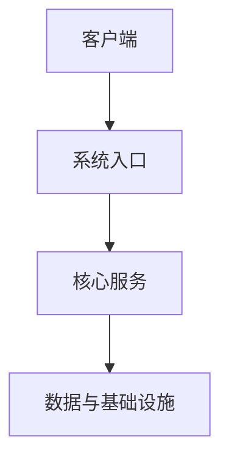
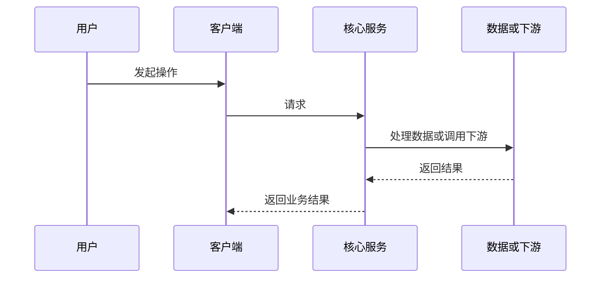

# {项目名称} 项目代码接手报告

> 分析范围：{项目或交付包范围}。结论来自当前可访问的源码、配置、构建、数据、部署、测试和文档材料；未实际运行验证的内容会明确标注。

## 1. 一页结论

<!-- 写 8 至 15 条可独立阅读的高密度结论。 -->

## 2. 代码包全景地图

| 目录或仓库 | 类型 | 核心职责 | 重要程度 | 组合或运行说明 |
| --- | --- | --- | --- | --- |

## 3. 总体功能说明

### 3.1 平台或产品定位

### 3.2 核心能力地图

| 能力域 | 功能说明 | 用户入口 | 主要代码或服务入口 |
| --- | --- | --- | --- |

### 3.3 核心业务闭环

## 4. 总体技术架构

### 4.1 运行时总览

### 4.2 技术栈

| 技术或框架 | 版本线索 | 在系统中的用途 | 证据入口 |
| --- | --- | --- | --- |

### 4.3 代码分层与关键机制

## 5. 部署架构

### 5.1 核心运行单元和端口

| 运行单元 | 服务或应用名 | 端口或路径 | 入口配置 | 是否主链路必需 |
| --- | --- | --- | --- | --- |

### 5.2 独立服务和中间件

### 5.3 编译与打包顺序

### 5.4 Docker、编排和发布材料

### 5.5 前端或客户端部署

### 5.6 配置装配和启动顺序

## 6. 模块职责与依赖关系

### 6.1 {核心模块名称}

- 模块定位：
- 核心职责：
- 关键入口：
- 上游与下游：
- 数据与配置：
- 完整性结论：

<!-- 继续按模块增加三级标题。 -->

## 7. 依赖关系详细说明

### 7.1 编译依赖

### 7.2 运行依赖

### 7.3 服务通信边界

### 7.4 数据库与存储依赖

### 7.5 配置依赖

### 7.6 外部集成

## 8. 前端应用结构

### 8.1 应用、框架与插件组合关系

### 8.2 页面或客户端能力域

### 8.3 版本、拼装和部署风险

## 9. 模块完整性评估

### 9.1 基本完整的核心模块

### 9.2 缺失或待确认的模块

| 模块或线索 | 预期证据 | 当前现状 | 影响 | 结论 | 置信度 |
| --- | --- | --- | --- | --- | --- |

### 9.3 版本、脚本和配置冲突

### 9.4 测试、质量与可运维性

### 9.5 项目级完整性矩阵

| 维度 | 状态 | 关键证据 | 主要影响 | 置信度 | 下一步验证 |
| --- | --- | --- | --- | --- | --- |
| 源码 |  |  |  |  |  |
| 构建 |  |  |  |  |  |
| 运行 |  |  |  |  |  |
| 部署 |  |  |  |  |  |
| 数据 |  |  |  |  |  |
| 测试 |  |  |  |  |  |
| 运维 |  |  |  |  |  |
| 文档 |  |  |  |  |  |

## 10. 典型调用链

### 10.1 {核心调用链名称}

<!-- 复杂项目继续补充 2 至 4 条最重要的调用链。 -->

## 11. 接手路线图

### 11.1 第一阶段：确认边界

### 11.2 第二阶段：跑通最小主链路

### 11.3 第三阶段：补齐并验证业务模块

### 11.4 第四阶段：工程治理

| 阶段 | 关键任务 | 前置条件 | 通过标准 | 产出物 |
| --- | --- | --- | --- | --- |

## 12. 接手时最该问交付方的问题

1. {来自代码冲突或无法静态确认的高价值问题}

## 13. 关键证据入口

| 证据用途 | 相对路径 | 支持的结论 |
| --- | --- | --- |

## 14. 最后建议

| 标准项 | 建议落地 |
| --- | --- |
| 主版本和工具链 |  |
| 主服务及客户端入口 |  |
| 配置与密钥管理 |  |
| 数据初始化与升级 |  |
| 部署和回滚 |  |
| 验证与测试 |  |
| 监控、备份和恢复 |  |
| 文档索引和维护责任 |  |

<!-- 最后回答：项目能否接手、最先做什么、完成什么才进入可维护状态。交付前删除所有模板占位符和注释。 -->
